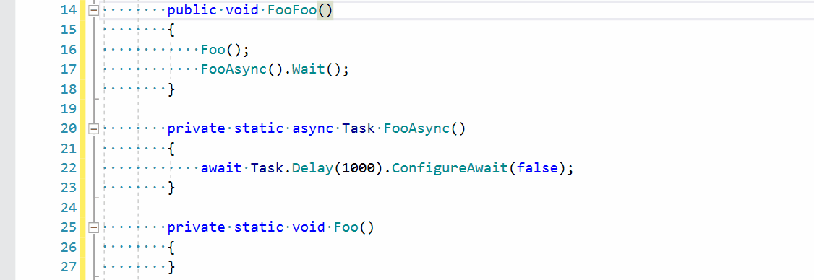
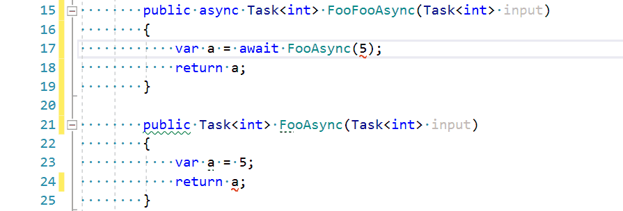

# AsyncConverter
Plugin for ReSharper, for helping you working and converting your code to `async`.

# Convert Any Method to Async Implementation
1. Replace return type to `Task` or `Task<T>`
2. Rename method and overrides and base and interface from &lt;MethodName&gt; to &lt;MethodName&gt;Async
3. Add using on `System.Threading.Tasks`
4. Analyze body and replace all calls to another method to `async` version if it exists.
5. Analyze body and replace all calls to `.Result` with `await` call.
6. Analyze using of this method. If method call is from `async` context, then replace it to `await`. If the method calls from sync context then replace calls to `.Result` or `.Wait()`

# Highlightings
## Replacing Value
If expect type `Task<int>`, but real type is `int`, you may wrap it to `Task.FromResult()`

## Return `null` as `Task`
If you return null from method with retuen type `Task` or `Task<T>`, then calling code may await it and get `NullReferenceException`.

## Suggesting method name with Async suffix
Suggest add method name Async suffix.
1. Do not suggest if contaning class is inherits from `Controller` or `ApiController`. 
2. Do not suggest if method is test. Support NUnit, XUnit and MsUnit.

## Suggesting configure all await expression with ConfigureAwait

## Suggesting use async method if it exist
If in async context call sync method, but exist async method with same signature and suffix Async, then suggest use async method.

## Async/await eliding
If in method only one await in the end of method, then async/await  may be elided.

