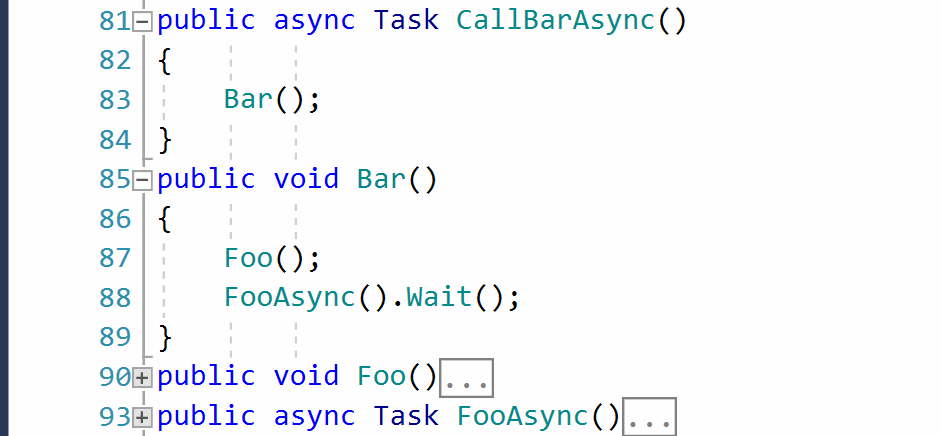
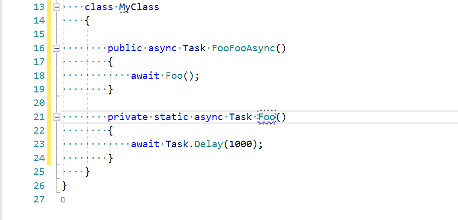
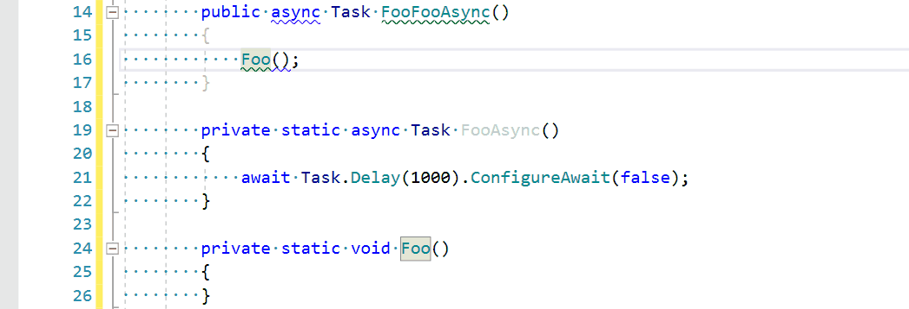

# AsyncConverter

This is an implementation of a ReSharper Plugin that converts your synchronous code to its asynchronous version and helps you to write your own asynchronous applications.

# Convert Any Method to Its Async Implementation

AsyncConverter can:

1. Replace a returning type with generic or non-generic `Task<T>` or `Task`
2. Rename a hierarchy of overridden methods from _&lt;MethodName&gt;_ to _&lt;MethodName&gt;Async_
3. Add the `System.Threading.Tasks` to a usings declaration
4. Analyze a method body and replace the every synchronous call with its `async` implementation if exists.
5. Analyze a method body and replace the every `.Result` call with the `await` call.
6. Analyze usage of a processed method. If the method is called from `async` context the AsyncConverter will replace its call with the `await` expression, otherwise it will just call `.Result` or `.Wait()`

    
Converter method to async demo

    

# Highlightings

## Convert `Wait()` and `Result` to `await`

Under `async` method replace `Wait()` and `Result` to `await`.

    
Replace wait to await demo

    

    
Replace result to await demo

    

## Return `null` as `Task`

If expected returning type is `Task` or `Task<T>` but null is returned instead, AsyncConverter warn you that execution point can await expected 'Task' and get `NullReferenceException`.

    
Return null as task demo

    

## Async suffix in a method name

AsyncConverter will suggest you to add the `Async` suffix to an asynchronous method name in all cases except:

1. Classes inherited from `Controller` or `ApiController`
2. Methods of test classes. NUnit, XUnit and MsUnit are supported. This may be turn off in _Resharper &rarr; Options &rarr; Code Inspection &rarr; Async Converter &rarr; Async Suffix_

    
Suggesting method name with Async suffix demo

    

## Suggesting to configure an every await expression with ConfigureAwait

    
Suggesting ConfigureAwait demo

    

## Suggesting to use the async method if exists

If a synchronous method is called in the async context and its asynchronous implementation exists (e.g method has same signature `Async` suffix and `Task` or `Task<T>` as the returning type) AsyncConverter will suggest you to use this asynchronous implementation.

Do not suggest to use obsolete async methods.

    
Suggesting method name with Async suffix demo

    

## Async/await ignoring

An `await` expression can be ignored if this `await` expression is the single in a method and awaited value is returned from a method.

    
Async/await ignoring demo

    

